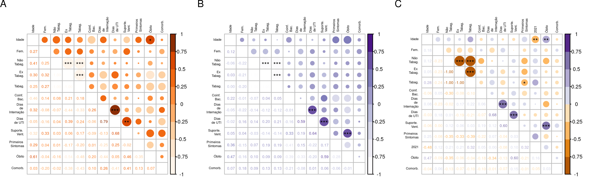
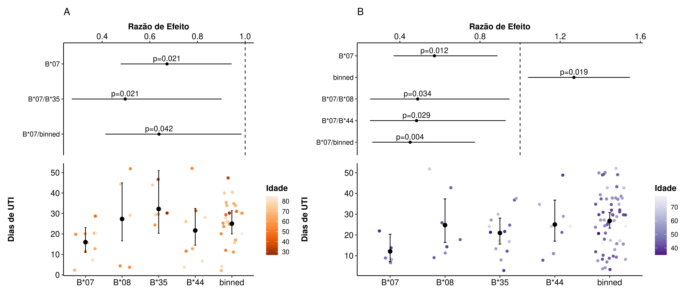
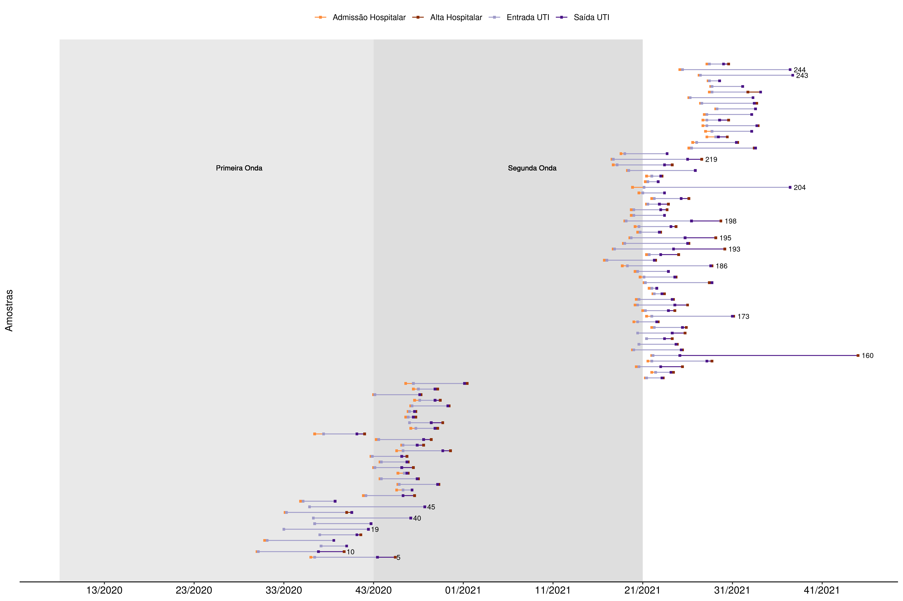
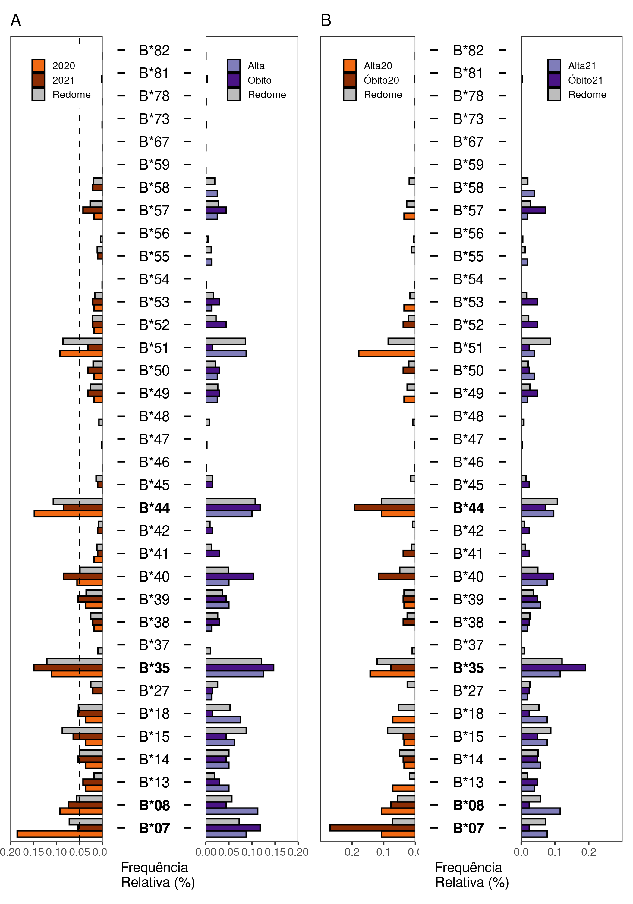

<style>
  body{
  text-align: justify
  }
  p.caption {
  font-size: 0.6em;
}
</style>

```{r, include=FALSE}
# knitr options
#knitr::opts_chunk$set(
	#echo = FALSE,
	#message = FALSE,
	#warning = FALSE)
# Load the package
#devtools::load_all()

```
# Procedimentos

&nbsp;&nbsp;&nbsp;&nbsp;&nbsp;&nbsp;Esse material apresenta uma explicação detalhada dos procedimentos de análise realizados no projeto de Iniciação Científica "*Perfil alélico HLA-B em pacientes admitidos por COVID-19 na Unidade de Tratamento Intensivo (UTI) do Hospital Municipal Padre Germano Lauck (Foz do Iguaçu/PR, Brasil) entre 2020 e 2021*", realizado com apoio do CNPq e da Universidade Federal da Integração Latino-Americana (UNILA). O projeto foi conduzido pelo bolsista Samuel Chagas de Assis, graduando em Biotecnologia, e orientado pela Profa. Dra. Maria Cláudia Gross com co-orientação da Profa. Dra. Maria Leandra Terencio e do Prof. Dr. Carlos Henrique Schneider. O grupo controle está fora do escopo dessa parte do projeto, o objetivo desse trabalho foi identificar padrões clínicos e genéticos na UTI entre 2020 e 2021. Futuramente, o grupo controle (enfermaria 2020) será incluído. 

Mais informações podem ser acessadas em:

  - [Relatório](https://github.com/chagas98/hlafozpublic/tree/main/Documents)
  
  - [Resumo Expandido EICTI](https://github.com/chagas98/hlafozpublic/tree/main/Documents)
  
  - [Código](https://github.com/chagas98/hlafozpublic)
  
Descrição das Figuras e Tabelas:

  - [Tabela 1](#tab1)
  
  - [Figura 1 e Tabela 2](#figs1)
  
  - [Figure 2](#figs2)
  
  - [Figura 3](#fig3)
  
  - [Figura 4](#fig4)
  
  - [Figura 5](#fig5)
  
  - [Dados](#datasets)
  
  - [Outros](#other)

```{r sources, include = FALSE}

# Setup env and dataset
source("./analysis/StatAnalysis/Setup.R")
source("./analysis/StatAnalysis/FunctionsDescriptive.R")
source("./analysis/StatAnalysis/FunctionsModels.R")
source("./analysis/useful_functions.R")
source("./analysis/StatAnalysis/FiguresTables.R")

```

---


<a name="tab1"></a>

# Tabela 1 

&nbsp;&nbsp;&nbsp;&nbsp;&nbsp;&nbsp;A tabela com as variáveis clínicas foi processada a partir do pacote R `gt_summary` utilizando os dados coletados em `data_final`. Sendos todas as comparações de grupos independentes, os p-valores foram calculados por teste rank sum de Wilcoxon (ou Mann-Whitney U) para variáveis contínuas não-paramétricas, teste de qui-quadrado de Pearson ou teste exato de Fisher bicaudal para variáveis categóricas, aplicadas em amostras menores (alguma amostragem <10) ou maiores, respectivamente.  Váriaveis paramétricas e não-paramétricas foram representadas como médias (DP - Desvio Padrão) e mediana (IQR - intervalo interquartil), respectivamente. As amostragens de 2020 e 2021 foram analisadas separadamente (2020 vs. 2021) e sub-agrupadas em relação ao desfecho de cada paciente (Alta20 vs. Obito20 e Alta21 vs. Obito21).


```{r tab1, echo = FALSE, fig.width=12, results="asis", fig.cap='A caption.', fig.topcaption=TRUE}

summary_table_final %>% 
  flextable::theme_vanilla() %>% 
  autofit(part = "all") 

```
```{r , include = FALSE}
savetab <- flextable::save_as_image(summary_table_final, "results/table1.png", webshot = "webshot2")
```


---

<a name="figs1"></a>


# Figura 1 e Tabela 2


&nbsp;&nbsp;&nbsp;&nbsp;&nbsp;&nbsp;As Figuras 1 e Tabela 2 apresentam a frequência dos alelos identificados a partir da genotipagem (descritos no [relatório](link)) dos grupos amostrais de 2020 e 2021, além da análise estatística.   


### Figura 1


&nbsp;&nbsp;&nbsp;&nbsp;&nbsp;&nbsp;A Figura 1A foi obtida através do pacote R `ggplot2` e apresenta a frequência dos alelos em ambos anos amostrais. Os alelos com menor frequência de ocorrência (<5% ou <5 ocorrências) de cada ano foram agrupados para reduzir a interferência de possíveis erros de sequenciamento e os níveis de variações  de *outliers* presentes nas amostragens. A linha tracejada marca o limiar n = 5 e as anotações destacadas do eixo x representam os alelos não agrupados em `binned`, grupo de alelos com frequência <%5. A Figura 1B representa as frequências obtidas a partir de cada ano e sub-agrupadas nos desfechos. 


```{r count, echo= FALSE, fig.cap='Figura 1 - Frequência dos alelos identificados. (A) agrupados em ano de coleta e (B) desfecho por ano de coleta. A linha tracejada em (A), n = 5, identifica os alelos com menor e maior frequência; as anotações destacadas no eixo x representam os alelos de maior frequência, não agrupados em "binned".  ', fig.topcaption=FALSE}

# from FiguresTables.R


```


&nbsp;&nbsp;&nbsp;&nbsp;&nbsp;&nbsp;Os testes foram conduzidos com significância estatística de 0.05 e realizados utilizando o pacote R `rstatix`com a função `row_wise_fisher_test()`. As frequências de cada uma dos agrupamentos presente na Figura 1 foram testados pelo Teste Exato de Fisher bicaudal em tabela de contigência 2x2, inserindo o número de ocorrência dos alelos em cada estratificação (Grupo 1 (n) e Grupo 2 (n)) e o total de ocorrências em cada estratificação para outros alelos (Outros 1 (n) e Outros 2(n)). Nos quatro testes realizados, o p-valor foi corrigido para múltiplas comparações utilizando a abordagem de Bonferroni. Os p-valores não ajustados menores que 0.1 são apresentados na Tabela 2 e disponibilizados integralmente na Tabela S1.


```{r fisheres, fig.width=8, echo = FALSE}


fisher_tab <- fisher_res %>%
  dplyr::select(-p.adj.signif) %>% 
  dplyr::filter(p < 0.1) %>%
  dplyr::mutate(
    p = rstatix::p_round(p, 2)) %>% 
  rename(Alelos = "allele") %>% 
  flextable::flextable() %>%
  fontsize(size = 8, part = "all") %>%
  autofit(part = "all") %>%
  align(align = "center", part = "all")%>% 
  flextable::theme_vanilla() 

fisher_tab

```

```{r, include = FALSE}

#savetab <- flextable::save_as_image(fisher_tab, "results/tablefis.png", webshot = "webshot2")

```
---


# Figura 2


&nbsp;&nbsp;&nbsp;&nbsp;&nbsp;&nbsp;As variáveis e indicadores clínicos foram  correlacionadas utilizando o pacote R `correlation`. As varíáveis independentes foram selecionadas considerando baixo percentual de dados ignorados/faltantes e em nível de significância comparado aos relatos da literatura. Além disso, variáveis dependentes, desfechou ou tempo de hospitalização, foram adicionadas buscando compreender a interação entre as variáveis para definição de potenciais preditores e confudidores que podem ser adicionados nos modelos de regressão. A função `correlation()` foi ajustada para função automática ("auto"), buscando selecionar os métodos mais relevantes para cada tipo de variável. Correlação policrônica foi conduzida quando valores ordinais estavam envolvidos (por exemplo, tabagismo, 1 - Não, 2 - Ex, 3 - Sim ), tetracrônica quando as variáveis possuem fatores binários, ponto-biserial para comparações entre binárias com valores contínuos e Pearson para testes contendo variáveis contínuas, etc. A função foi ajustada para executar correlações parciais condicionada a outras variáveis. Além disso, os p-valores foram corrigidos para múltiplas comparações utilizando a abordagem de Bonferroni. 
<br>


```{r corr, echo = FALSE, fig.cap='Figura 2 - Correlação entre variáveis clínicas em (A) 2020, (B) 2021 e (c) ambos os anos. p < 0.05 (*), p < 0.02 (**), p < 0.01 (***)', fig.topcaption=FALSE}



```

---


## Tabela 3

&nbsp;&nbsp;&nbsp;&nbsp;&nbsp;&nbsp;O modelo para avaliar a associação entre os grupos alélicos HLA-B foram conduzido por um modelo de associação aditivo (h/h vs h/- vs -/-). O desfecho (alta - 0, óbito - 1) ou ano de coleta ( 2020 - 0, 2021 - 1) foram utilizados como variáveis dependentes para avaliar a influcência dos alelos e alelos ajustados com a idade. O modelo de regressão logística foi implementado utilizando o pacote R `HIBAG` e as funções `hlaAllele()` e `hlaAssociTest` foram utilizados para calcular as estimativas de razão de chances (OR), intervalo de confiança (CI) e p-valores.  Foram testados os sub-grupos em cada ano baseado no desfecho, os quais não apresentaram resultados significativos, mesmo ajustados para idade. Enquanto isso, avaliou-se a ocorrência de cada um dos grupos alélicos entre os dois ano de coleta, os quais apresentaram as seguintes significâncias: 

```{r logit, fig.width=8, echo = FALSE, warning=FALSE}


logityearadj %>%
  rstatix::adjust_pvalue(p.col = "h.pval", method = "bonferroni") %>% 
  dplyr::select(allele, h.est_OR, 
                `h.2.5%_OR`, `h.97.5%_OR`,
                h.pval, h.pval.adj) %>% 
  dplyr::mutate_at(vars(-allele), funs(round(., 2))) %>% 
  dplyr::rename(Alelos = "allele",
                `OR` = "h.est_OR",
                `2.5%CI` = "h.2.5%_OR",
                `97.5%CI` = "h.97.5%_OR",
                `p` = "h.pval",
                `p.adj` = "h.pval.adj"
                ) %>%
  flextable::flextable() %>%
  flextable::fontsize(size = 8, part = "all") %>%
  flextable::autofit(part = "all") %>% 
  flextable::theme_vanilla()
```


----


## Figura 3


&nbsp;&nbsp;&nbsp;&nbsp;&nbsp;&nbsp;Após executar etapas de diagnóstico de diferentes modelos (Figura S3), um modelo de regressão negativa binomial (NB) foi conduzido para verificar o efeito de cada alelo na tempo de permanência na UTI. O modelo utiliza da variável `ICU_days` como variável dependente e os alelos (`alelle`) foram considerados como variáveis nomiais e independentes.


$$\hat{ICUdays_y} = e^{Intercept+ b_{1}I(X_{B_{08}})...+b_{j}I(X_{B_{binned}}) + b_{j+1}(X_c)}$$

&nbsp;&nbsp;&nbsp;&nbsp;&nbsp;&nbsp;A análise foi conduzida com alelos com frequência superior a 0.05% (ou >5 ocorrências em cada coleta), sendo $j$ o número de alelos selecionados,  e o restante agrupados em `binned`, ajustando para variáveis clínicas $X_c$. Como não houve um grupo controle/tratamento, a seguinte análise foi conduzida com caráter descritivo buscando a razão de  efeito entre os alelos coletados de cada ano separadamente. Através do pacote R `MASS`, o modelo foi processado pela função `glm.nb()` e as médias marginais modeladas de cada alelo foram obtidas através do pacote R `emmeans` com a função `emmeans()`, onde o modelo em função de ligação logaritimica possuem efeito aditivo, ou seja, os expoentes dos coeficientes são as médias de cada alelo para o período na UTI. Devido a falta de um grupo controle, o alelo com a menor média de incidência foi utilizado como base para o cálculo da regressão (`intercept`), ou seja, o grupo alélico `B*07`. Os modelos foram separados em 2020 e 2021 ($ICUdays_{2020}$ e $ICUdays_{2021}$), assim como testado com covariáveis de desfecho e idade, identificados na análise de correlação e com relevância clínica, respectivamente.   No entanto, em uma ánalise *post hoc* das médias modeladas, a razão de efeito foi conduzida entre os grupos alélicos e o efeito de cada alelo em relação a média geral dos grupos analisados. O modelo não apresentou alteração significativa quando ajustado para `idade` (dados não apresentados).


```{r glmnb1 , echo = FALSE, fig.cap='Figura 3 - Razão de efeito a partir do modelo de regressão binomial negativa ajustado para idade para (A) 2020 e (B) 2021', fig.topcaption=FALSE}
#https://ncss-wpengine.netdna-ssl.com/wp-content/themes/ncss/pdf/Procedures/NCSS/Negative_Binomial_Regression.pdf

#interpret


```

----

## Figura 4

$$\hat{ICUdays_y} = e^{Intercept + b_{interaction}(HLAB_{08}*Outcome) ... + b_{interaction}(HLAB_{binned}*Outcome)}$$

&nbsp;&nbsp;&nbsp;&nbsp;&nbsp;&nbsp;A Figura 4 utiliza do mesmo procedimento utilizado na Figura 3, mas buscando avaliar a interação entre os grupos alélicos e desfecho no tempo de permanência na UTI. 


```{r glmnb2 , echo = FALSE, fig.cap='Figura 3 - Razão de efeito a partir do modelo de regressão binomial negativa ajustado para idade para (A) 2020 e (B) 2021', fig.topcaption=FALSE}


```

----

## Materiais Suplementares

### Figura S1
&nbsp;&nbsp;&nbsp;&nbsp;&nbsp;&nbsp;Os *outliers* foram retirados utilizando `dplyr::filter()`, excluindo pacientes com dias de internação superior a 65 dias. 


```{r s1 , echo = FALSE, fig.cap='Figura S1 - Filtragem de dados descripantes. Dados brutos de (A) 2020 e (B) 2021. Dados filtrados (<65 dias de Hospital) de (C) 2020 e (D) 2021.', fig.topcaption=FALSE}


```

----

### Figura S2
&nbsp;&nbsp;&nbsp;&nbsp;&nbsp;&nbsp;Os pacientes foram selecionados ao final de cada onda epidemiológica como descrito em [@bastos_covid-19_2021].


```{r s2 , echo = FALSE, fig.cap='Figura S2 - Período de coleta das amostras. Amostras identificadas com seus respectivos números foram filtradas (>65 dias). Primeria onda: 8/2020 à 43/2020 semana; Segunda onda: 43/2020 à 21/2021.', fig.topcaption=FALSE}




```

----

### Figura S3


&nbsp;&nbsp;&nbsp;&nbsp;&nbsp;&nbsp;A Figura S3 foi obtida através do pacote R `ggplot2` e apresenta a frequência relativa (%) dos alelos em ambos anos amostrais, em conjunto com as frequências alélicas disponibilizadas pelo Registro Nacional de Doadores de Médula Óssea (REDOME) e coletadas no *Allele Frequency Net Database (AFND)* para o Estado do Paraná, Brasil [@gonzalez-galarza_allele_2020]. O acesso ao AFND foi realizado por meio do pacote R `immunotation` com a função `query_allele_frequencies()`. A linha tracejada marca o limiar (Figura S1A), FR = %5, e as anotações destacadas do eixo x representam os alelos não agrupados em `binned`, grupo de alelos com frequência <%5. A Figura 1B representa as frequências obtidas a partir de cada ano e sub-agrupadas nos desfechos. 


```{r count1, echo= FALSE, fig.cap='Figura S1 - Frequência relativa (%) dos alelos identificados e das frequências coletadas no REDOME. (A) agrupados em ano de coleta e desfecho total e (B) por ano de coleta e desfecho. A linha tracejada em (A), %5, identifica os alelos com menor e maior frequência; as anotações destacadas no eixo x representam os alelos de maior frequência, não agrupados em "binned".  ', fig.topcaption=FALSE}



```


----


### Models Check

#### ICU_days ~ allele + Age (2020)

```{r check1, echo= FALSE, fig.height= 10, fig.width= 10, fig.cap='ICU_days ~ allele + Age.', fig.topcaption=FALSE}

modelchecking(glmmod0, "glm")

```

#### ICU_days ~ allele + Age (2021)
```{r check2, echo= FALSE, fig.height= 10, fig.width= 10, fig.cap='ICU_days ~ allele + Age.  ', fig.topcaption=FALSE}

modelchecking(glmmod1, "glm")

```


#### ICU_days ~ allele*Outcome (2020)
```{r check3, echo= FALSE, fig.height= 10, fig.width= 10, fig.cap='ICU_days ~ allele*Outcome  ', fig.topcaption=FALSE}

modelchecking(glmmodint0, "glm")

```


#### ICU_days ~ allele*Outcome (2021)
```{r check4, echo= FALSE, fig.height= 10, fig.width= 10, fig.cap='ICU_days ~ allele*Outcome  ', fig.topcaption=FALSE}

modelchecking(glmmodint1, "glm")

```


## Dados (Entrada e Resultados)

- [Dados de Entrada](https://github.com/chagas98/hlafozpublic/tree/main/input)

- [Resultados adicionais](https://github.com/chagas98/hlafozpublic/tree/main/results)


# REFERÊNCIAS

<br>
<div id="refs"></div>
<br>
